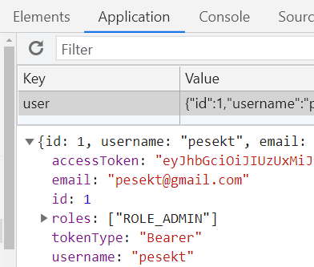

# React.js CRUD App with React.js & Axios

This web client app is designed to communicate with the Spring Boot web server app: [gitHub link](https://github.com/pesekt1/SWC3-Web-Server)

This project was bootstrapped with [Create React App](https://github.com/facebook/create-react-app).

## Project setup

### Set port

.env

```
PORT=8081
```

In the project directory, you can run:

```
npm install
```

This will install all the project dependencies from package.json.

### start the app

```
npm start
```

Open [http://localhost:8081](http://localhost:8081) to view it in the browser.

The page will reload if you make edits..

## Http communication

### Axios library

```javascript
import axios from "axios";
import { toast } from "react-toastify";
import authHeader from "./auth-header";

//set default baseURL so when we use http request this will be add in front
//example: http.get("/users") will be http.get("http://localhost:3900/api/users") in development env
axios.defaults.baseURL = process.env.REACT_APP_API_URL;

axios.interceptors.response.use(null, (error) => {
  console.log("interceptor called");
  if (error.response.status === 401) {
    console.log("Unauthorized access");
  }
  const expectedError =
    error.response &&
    error.response.status >= 400 &&
    error.response.status < 500;

  if (!expectedError) {
    toast.error("Unexpected error occured");
    console.log("logging unexpected error", error);
  }
  return Promise.reject(error);
});

export default {
  get: axios.get,
  delete: axios.delete,
  post: axios.post,
  put: axios.put,
  authHeader,
};
```

Example: get tutorials:

```javascript
  retrieveTutorials(currentPage) {
    //axios.get("http://localhost:5557/api/tutorials?...")
    http
      .get("/tutorials?page=" + currentPage, {
        headers: http.authHeader(),
      })
      .then((response) => {
        //this is the response from web server
        this.setState({
          tutorials: response.data.tutorials,
          currentPage: response.data.currentPage,
          totalPages: response.data.totalPages,
        });
```

## Project structure

Render the App component in the placeholder called "root" in the index.html:

index.js:

```javascript
ReactDOM.render(<App />, document.getElementById("root"));
```

public/index.html:

```html
  <head>
    ...
  </head>
  <body>
    <div id="root"></div>
  </body>
</html>
```

App.js:

- Defines the SPA components -single page application components that are being changed dynamically.

## Security

Registration and login:

- auth.service.js:

  - login: Sending credentials to the login endpoint on the web server. If there is a JWT (Json Web Token) in the response, save it in browser's local storage.

    ```javascript
    login(username, password) {
        return http.post("auth/signin", {username,password})
        .then((response) => {
            if (response.data.accessToken) {
            localStorage.setItem("user", JSON.stringify(response.data));
            }
            return response.data;
        });
    }
    ```

  - registration:

    ```javascript
    register(username, email, password) {
        //return axios.post(API_URL + "signup", {
        return http.post("auth/signup", {
        username,
        email,
        password,
        });
    }
    ```

Note: Registration could be improved to automatically login if successful.

Browser's LocalStorage:



This Json Web Token can now be used for all http requests - it can be simply taken from local storage and used in the http headers where the web server expects it:

Example:

```javascript
  retrieveCustomers() {
    http
      .get("/customers", { headers: http.authHeader() )
      .then((response) => {
```

authHeader() - Returns the Authorization key-value pair for the http header:

```javascript
export default function authHeader() {
  const user = JSON.parse(localStorage.getItem("user"));

  if (user && user.accessToken) {
    return { Authorization: "Bearer " + user.accessToken }; // for Spring Boot server
    //return { 'x-access-token': user.accessToken }; // for Node.js Express server
  } else {
    return {};
  }
}
```
